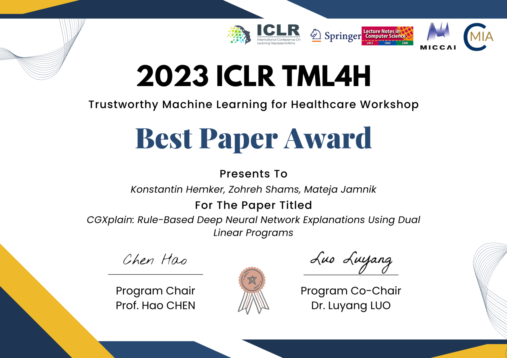
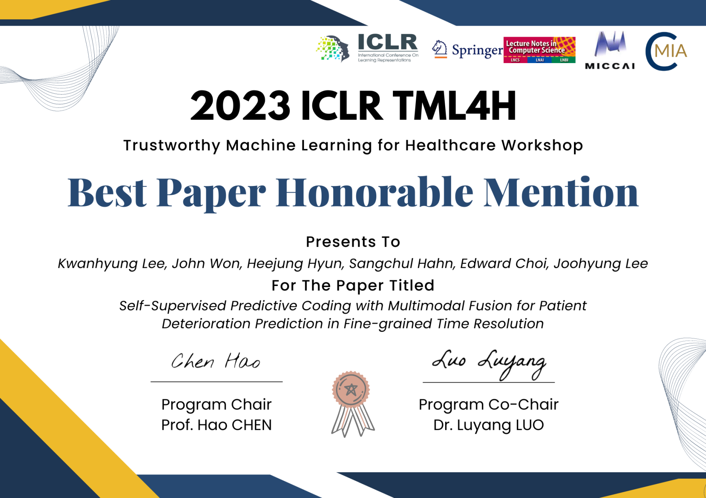

<!--StartFragment-->

The [2023 ICLR Workshop on Trustworthy Machine Learning for Healthcare (TML4H)](https://sites.google.com/view/tml4h2023) has successfully concluded! We would like to thank the Advisory and Program Committees for their strong support, as well as the Student Organizers for their dedicated assistance. 

The conference received endorsement from MICCAI and featured six keynote speakers and 18 oral presentations. Accepted papers will be published in the Springer Lecture Notes in Computer Science series. One Best Paper Award (for interpretable research by Konstantin from the University of Cambridge) and two Honorable Mentions were awarded. 

We look forward to seeing everyone again at next year's TML4H workshop!
<!--EndFragment-->

<!--StartFragment-->

## **Call for papers for Post-workshop JBHI special issue**

As part of the post-workshop activities, we are organizing a special issue in the [IEEE Journal of Biomedical and Health Informatics (J-BHI) titled "Trustworthy Machine Learning for Health Informatics"](https://www.embs.org/jbhi/wp-content/uploads/sites/18/2023/05/Trustworthy-20230401_CallforPapers_TMLH.pdf). We welcome submissions of relevant articles in this field!

<!--EndFragment-->

<!--StartFragment-->

### **Important Dates**

Paper Submission Deadline: September 1, 2023

First Reviews Due: November 1, 2023

Revised Manuscript Due: January 1, 2024

Final Decision: March 1, 2024

<!--EndFragment-->