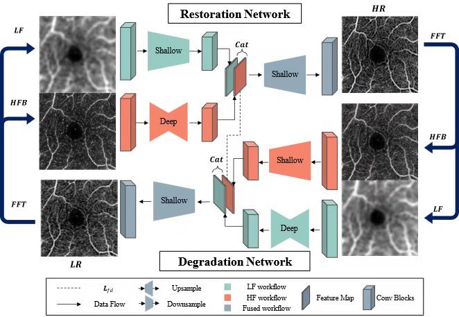
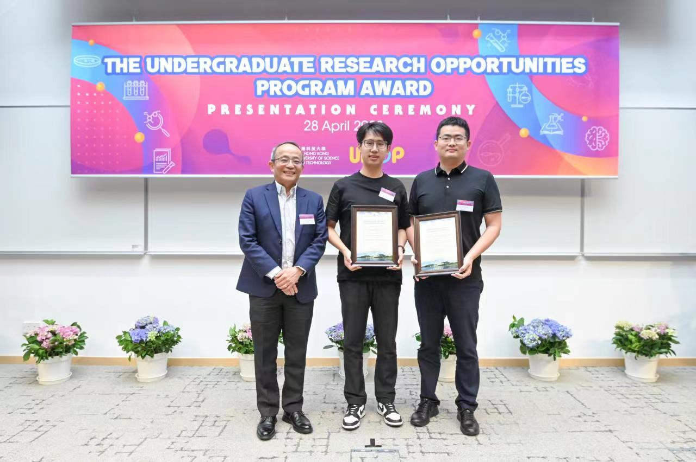
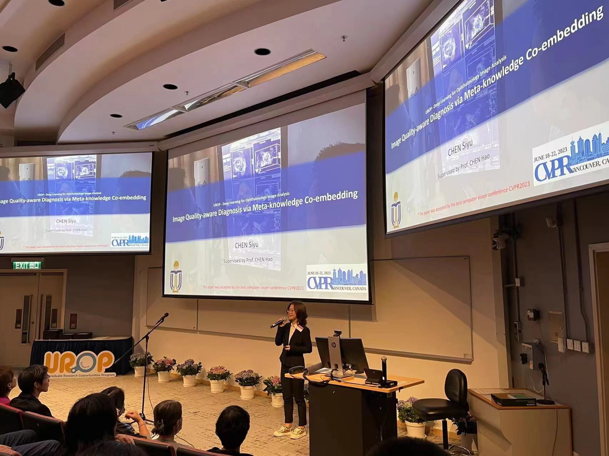

<!--StartFragment-->

Two Intern UG students, Siyu CHEN and Weiwen ZHANG from HKUST SMART lab has won HKUST UROP awards. The [HKUST UROP (Undergraduate Research Opportunities Program)](https://urop.hkust.edu.hk/) is a university-wide program that provides opportunities for undergraduate students to participate in research projects under the supervision of faculty members. The program aims to nurture students' research skills and broaden their horizons through hands-on experience in research. Congrats to all! 

The **Undergraduate Research Opportunities Program Award** (formerly known as the Mr. Armin and Mrs. Lillian Kitchell Undergraduate Research Award) is presented to students who have demonstrated outstanding performance in completing UROP projects each year. More than 700 students participate in UROP projects annually, and only **seven** awards are granted, representing the **top 1%** of UROP participants. These include **one** Champion, **two*** First Runner-ups, **three** Second Runner-ups, and one Best Poster Presentation Award. Supervisors of awardees are also presented with the UROP Faculty Research Award. 

This prestigious award recognizes the exceptional research guidance provided by the supervisors and rewards outstanding students for their hard work. Furthermore, it serves as a source of motivation and inspiration for students to pursue their research interests in the future.

We will attract more talented UG students to work with us in the future. If you are HKUST students and you are interested in Medical Image Analysis, please contact us via email in the [Contact page](https://hkustsmartlab.netlify.app/contact/).

The following are the detail of the two projects on the topic *Deep Learning for Ophthalmology Image Analysis*.
<!--EndFragment-->

<!--StartFragment-->

## **Weiwen's Project**

*This project is supervised by Hao CHEN, PI of SMART Lab. This paper has been accepted by the top-tier conference  Medical Image Computing and Computer Assisted Interventions 2022*.

**Abstract**: Optical Coherence Tomography Angiography (OCTA) is a novel imaging modality that captures the retinal and choroidal microvasculature in a non-invasive way. So far, 3 mm × 3 mm and 6 mm × 6 mm scanning protocols have been the two most widely-used field-of-views. Nevertheless, since both are acquired with the same number of A-scans, resolution of 6 mm × 6 mm image is inadequately sampled, compared with 3 mm × 3 mm. Moreover, conventional supervised super-resolution methods for OCTA images are trained with pixel-wise registered data, while clinical data is mostly unpaired. This paper proposes an inverse-consistent generative adversarial network (GAN) for archiving 6 mm × 6 mm OCTA images with super resolution. Our method is designed to be trained with unpaired 3 mm × 3 mm and 6 mm × 6 mm OCTA image datasets. To further enhance the super-resolution performance, we introduce frequency transformations to refine high-frequency information while retaining low-frequency information. Compared with other state-of-the-art methods, our approach outperforms them on various performance metrics.

**UROP Award Experiences**:
It is my immense pleasure to receive this UROP award under the supervision of Prof. CHEN. I have participated in Prof. CHEN's research project since the summer of my fourth year as an undergraduate. Throughout my UROP experience, Prof. CHEN and PhD in the group guided me through every stage of the research process. I have learned how to conduct thorough literature reviews, propose effective methodologies, design experiments, write research papers, submit them for conferences, and even prepare rebuttals. Prof. CHEN has constantly provided me with encouragement and support, helping me overcome any obstacles that came my way. Thanks to this valuable and fruitful UROP experience, I feel empowered to continue exploring exciting research topics in the future.

<!--EndFragment-->

<!--StartFragment-->

## **Siyu's Project**

*This project is supervised by Hao CHEN, PI of SMART Lab and co-supervised by Haoxuan CHE, a PhD student of SMART Lab. Siyu contributes to crucial experiments of this project. The resulting paper has been accepted by the top-tier conference IEEE/CVF Computer Vision and Pattern Recognition 2023.*

**Abstract**: Deep learning method application on high-quality (HQ) medical images have shown promising results, however, medical images usually suffer from image degradations which caused a totally different situations compared with HQ images. In clinical practice, researchers intend to filter out low-quality (LQ) images to increase the performance of deep learning method while ignoring significant value of those LQ images. In this work, we raised the problem of image quality-aware diagnosis (IQAD) aiming to use LQ images and image quality labels to achieve better performance on medical images. And we proposed a new method, noted as Meta-knowledge Co-embedding Network (MKCNet) for this problem which outperformed other methods. 

**UROP Award Experiences**:
I’m so glad to be awarded. UROP gives me a really valuable research experience. When I first came to UROP project, I know nothing about how to start a research program. I learnt totally from scratch. After two year’s working, I’m standing here with this award. Thanks to UROP support. And I’d like to show my great thanks to my supervisor, prof. CHEN, who guided me on this research journey. He taught me where to start, help me improve research idea and finally delivered a paper. I’m very happy and honored to work with him. Also, thanks to our research lab and PhD students working with me. Thanks to all who give me this chance to learn and made some research contributions. I will keep on the way.

<!--EndFragment-->

