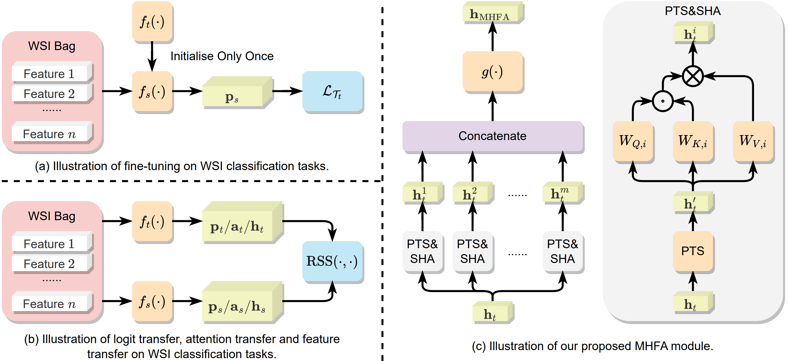

## [Knowledge Transfer via Multi-Head Feature Adaptation for Whole Slide Image Classification](https://arxiv.org/pdf/2303.05780.pdf)

Transferring prior knowledge from a source domain to the same or similar target domain can greatly enhance the performance of models on the target domain. However, it is challenging to directly leverage the knowledge from the source domain due to task discrepancy and domain shift. To bridge the gaps between different tasks and domains, we propose a Multi-Head Feature Adaptation module, which projects features in the source feature space to a new space that is more similar to the target space. Knowledge transfer is particularly important in Whole Slide Image (WSI) classification since the number of WSIs in one dataset might be too small to achieve satisfactory performance. Therefore, WSI classification is an ideal testbed for our method, and we adapt multiple knowledge transfer methods for WSI classification. The experimental results show that models with knowledge transfer outperform models that are trained from scratch by a large margin regardless of the number of WSIs in the datasets, and our method achieves state-of-the-art performances among other knowledge transfer methods on multiple datasets, including TCGA-RCC, TCGA-NSCLC, and Camelyon16 datasets.

