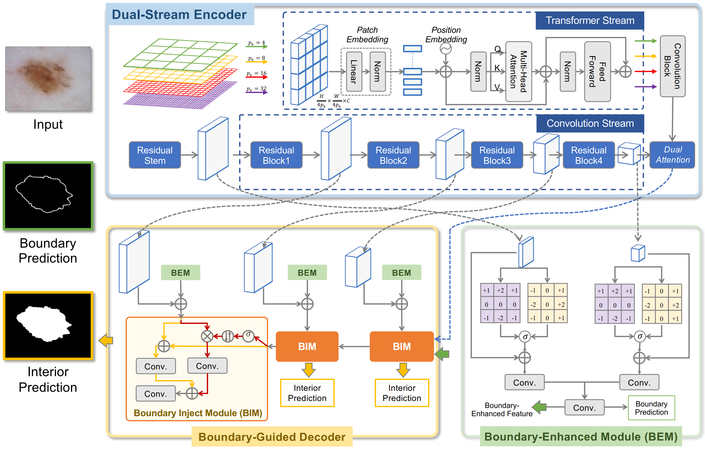

## [Rethinking Boundary Detection in Deep Learning Models for Medical Image Segmentation](https://arxiv.org/pdf/2305.00678.pdf)

Medical image segmentation is a fundamental task in the community of medical image analysis. In this paper, a novel network architecture, referred to as Convolution, Transformer, and Operator (CTO), is proposed. CTO employs a combination of Convolutional Neural Networks (CNNs), Vision Transformer (ViT), and an explicit boundary detection operator to achieve high recognition accuracy while maintaining an optimal balance between accuracy and efficiency. The proposed CTO follows the standard encoder-decoder segmentation paradigm, where the encoder network incorporates a popular CNN backbone for capturing local semantic information, and a lightweight ViT assistant for integrating long-range dependencies. To enhance the learning capacity on boundary, a boundary-guided decoder network is proposed that uses a boundary mask obtained from a dedicated boundary detection operator as explicit supervision to guide the decoding learning process. The performance of the proposed method is evaluated on six challenging medical image segmentation datasets, demonstrating that CTO achieves state-of-the-art accuracy with a competitive model complexity.

