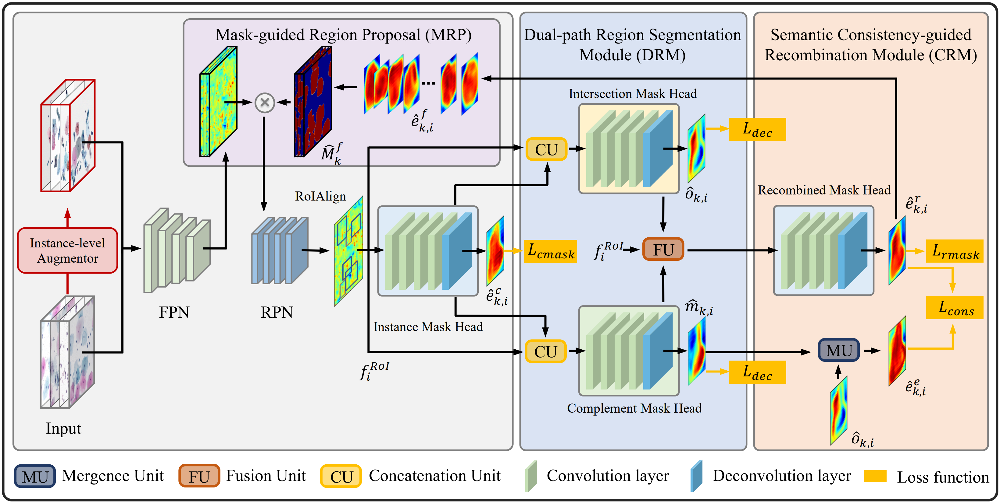
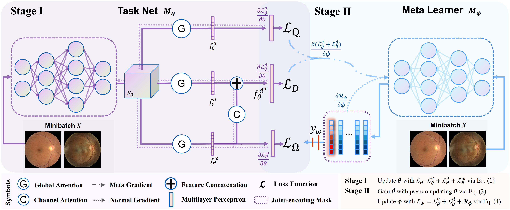
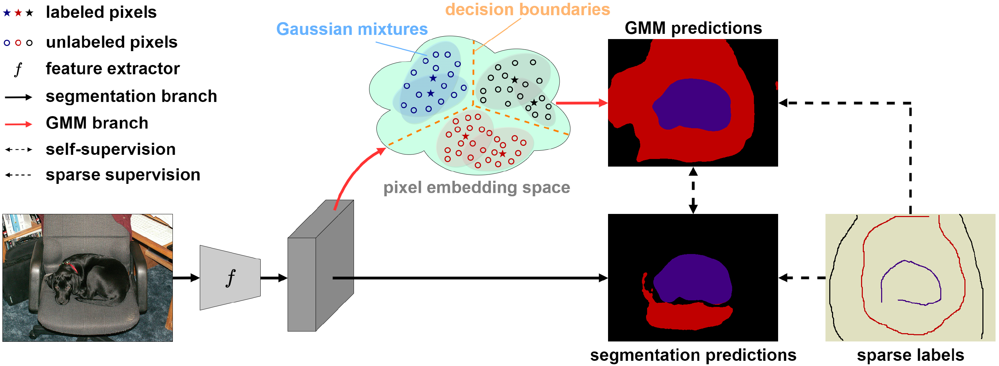

## [DoNet: Deep De-overlapping Network for Cytology Instance Segmentation](https://arxiv.org/pdf/2303.14373.pdf)

Cell instance segmentation in cytology images has significant importance for biology analysis and cancer screening, while remains challenging due to 1) the extensive overlapping translucent cell clusters that cause the ambiguous boundaries, and 2) the confusion of mimics and debris as nuclei. In this work, we proposed a De-overlapping Network (DoNet) in a decompose-and-recombined strategy. A Dual-path Region Segmentation Module (DRM) explicitly decomposes the cell clusters into intersection and complement regions, followed by a Semantic Consistencyguided Recombination Module (CRM) for integration. To further introduce the containment relationship of the nucleus in the cytoplasm, we design a Mask-guided Region Proposal Strategy (MRP) that integrates the cell attention maps for inner-cell instance prediction. We validate the proposed approach on ISBI2014 and CPS datasets. Experiments show that our proposed DoNet significantly outperforms other state-of-the-art (SOTA) cell instance segmentation methods.

## [Image Quality-aware Diagnosis via Meta-knowledge Co-embedding](https://arxiv.org/pdf/2303.15038.pdf)

Medical images usually suffer from image degradation in clinical practice, leading to decreased performance of deep learning-based models. To resolve this problem, most previous works have focused on filtering out degradationcausing low-quality images while ignoring their potential value for models. Through effectively learning and leveraging the knowledge of degradations, models can better resist their adverse effects and avoid misdiagnosis. In this paper, we raise the problem of image quality-aware diagnosis, which aims to take advantage of low-quality images and image quality labels to achieve a more accurate and robust diagnosis. However, the diversity of degradations and superficially unrelated targets between image quality assessment and disease diagnosis makes it still quite challenging to effectively leverage quality labels to assist diagnosis. Thus, to tackle these issues, we propose a novel meta-knowledge co-embedding network, consisting of two subnets: Task Net and Meta Learner. Task Net constructs an explicit quality information utilization mechanism to enhance diagnosis via knowledge co embedding features, while Meta Learner ensures the effectiveness and constrains the semantics of these features via meta-learning and joint-encoding masking. Superior performance on five datasets with four widely-used medical imaging modalities demonstrates the effectiveness and generalizability of our method.

## Sparsely Annotated Semantic Segmentation with Adaptive Gaussian Mixtures

Sparsely annotated semantic segmentation (SASS) aims to learn a segmentation model by images with sparse labels (i.e., points or scribbles). Existing methods mainly focus on introducing low-level affinity or generating pseudo labels to strengthen supervision, while largely ignoring the inherent relation between labeled and unlabeled pixels. In this paper, we observe that pixels that are close to each other in the feature space are more likely to share the same class. Inspired by this, we propose a novel SASS framework, which is equipped with an Adaptive Gaussian Mixture Model (AGMM). Our AGMM can effectively endow reliable supervision for unlabeled pixels based on the distributions of labeled and unlabeled pixels. Specifically, we first build Gaussian mixtures using labeled pixels and their relatively similar unlabeled pixels, where the labeled pixels act as centroids, for modeling the feature distribution of each class. Then, we leverage the reliable information from labeled pixels and adaptively generated GMM predictions to supervise the training of unlabeled pixels, achieving online, dynamic, and robust self-supervision. In addition, by capturing category-wise Gaussian mixtures, AGMM encourages the model to learn discriminative class decision boundaries in an end-to-end contrastive learning manner. Experimental results conducted on the PASCAL VOC 2012 and Cityscapes datasets demonstrate that our AGMM can establish new state-of-the-art SASS performance.

